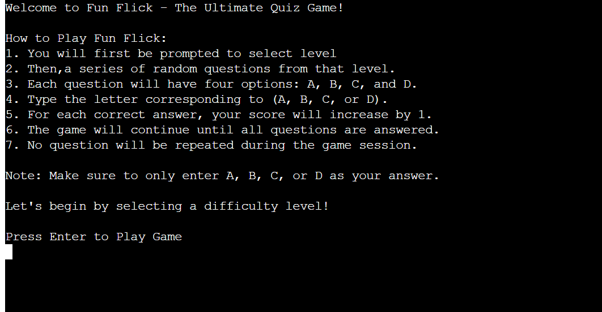

# [FUN FLICKS](https://fun-flicks-3ac6ed0650bd.herokuapp.com)

# Project Overview:
The Fun Flick - The Ultimate Quiz Game aims to provide an entertaining and educational experience for cat lovers. This project presents a fun and engaging quiz game that challenges players' knowledge about cats. Through a series of multiple-choice questions, players test their understanding of various cat-related facts, from breeds and behaviors to fun trivia.

## Target Audience:
This quiz game is specifically designed for:

- Cat lovers of all ages who want to test or expand their knowledge of cats.
- Pet enthusiasts who enjoy learning fun and fascinating facts about cats.
- Children and young adults who are interested in animals and enjoy playing quizzes for entertainment.
- General trivia fans who enjoy light-hearted, casual quiz games as part of their recreation.

## How It Will Be Useful:
- Entertainment and Fun: The quiz provides a light-hearted game to pass the time, making it fun for cat lovers to engage with a subject they are passionate about.

- Learning Experience: Players will learn interesting facts about cats while playing. Whether it’s about different breeds, cat behaviors, or fun trivia, the quiz is both enjoyable and educational.

- Friendly Challenge: Players can challenge themselves or friends, seeing how much they know about cats. It's a great way for people to bond over a shared interest while improving their knowledge.

- Ease of Use: The game is simple and user-friendly, with clear instructions on how to play. Players only need to input the corresponding letter of their chosen answer, making it accessible even for younger audiences.

source: [amiresponsive](https://ui.dev/amiresponsive?url=https://fun-flicks-3ac6ed0650bd.herokuapp.com)

## Features

### Existing Features
1. **A Series of Random Cat-Related Questions**
- **Value:** This ensures variety in gameplay, keeping the user engaged with different questions each time they play.
- **Benefits**:
    - **Keeps the Game Fresh:** Randomized questions mean users can play multiple times without facing the same set of questions, keeping the game interesting and enjoyable.
    - **Engagement:** Users are motivated to continue playing since they can expect new challenges each time.
    - **Knowledge Expansion:** It provides an opportunity for cat lovers to learn new things every time they play, building their knowledge with fun facts.

2. **Multiple-Choice Answers (A, B, C, or D)**
- **Value:** The multiple-choice format is easy to understand and makes the game accessible to users of all ages.

- **Benefits:**
- **Simple Interaction:** The user only needs to input one letter (A, B, C, or D) to answer, making the game easy for everyone, including young players and those unfamiliar with complex games.
    - **Instant Gratification:** With clear options, players get immediate feedback, which creates a sense of accomplishment when they choose the correct answer.
    - **Low Entry Barrier:** No prior knowledge of gaming is required, making it user-friendly for all skill levels.

3 **Score Tracking System**

- **Value:** Tracks the player's correct answers, adding a layer of competition and motivation for players to do better.

- **Benefits:**
    - **Motivation to Improve:** Users can track their performance and are motivated to replay the game to achieve higher scores.
    - **Friendly Competition:** Players can compare their scores with friends or family, adding a social and competitive aspect to the game.
    - **Sense of Progress:** The score system provides a clear indication of the user’s knowledge growth, allowing them to see how much they’ve learned.

   

4. **Fun Facts and Educational Content**
    **Value:** Provides both entertainment and educational content, making the quiz not only fun but also informative.

    **Benefits:**
     - **Learn While Having Fun:** Players can increase their knowledge about cats in an engaging and enjoyable way.
     - **Broad Appeal:** Cat lovers and trivia enthusiasts alike will find value in learning new and interesting facts about cats.
     - **Enriching Content:** The game enhances the user’s knowledge of cats without feeling like a learning task, turning education into an entertaining experience.
     

5. **Simple and Clear Game Instructions**
   - **Value:** Clear and easy-to-understand instructions ensure that all users, including beginners, can start the game without confusion.

   - **Benefits:**
     - ***Quick Start:*** Users can jump right into the game without needing to figure out complex rules, which makes the experience smooth and enjoyable.
     - **No Frustration:** The straightforward instructions prevent any potential frustration, ensuring a positive user experience from the beginning.
     - **Wide Accessibility:** With easy rules, the game is accessible to players of all ages and experience levels.
     

6. **Non-Repeating Questions Per Session**

   - **Value:** Prevents repetition of questions during a single session, maintaining the game’s freshness and novelty.

   - **Benefits:**
    - **Avoids Boredom:** The game avoids the boredom that could arise from repeated questions, keeping users engaged throughout the session.
    - **Extended Play Value:** Users are encouraged to play more since they won’t encounter the same questions multiple times in a single session, enhancing the overall experience.
   - **Replayability:** By offering fresh content every time, it gives players a reason to return and play again.
   

### Future Features

- **Timer for Each Question**
    - **Idea:** Introduce a countdown timer for each question to add a sense of urgency and excitement.
    - **Value:** This will make the game more challenging by encouraging players to think quickly, adding an extra layer of difficulty.
    - **Benefit:** Boosts engagement for trivia fans who enjoy time-based challenges, encouraging faster decision-making and adding a competitive edge.

- **Difficulty Levels**
    - **Idea:** Implement different difficulty levels (e.g., easy, medium, hard) that the player can select at the start of the game.
    - **Value:** Allows users of varying knowledge levels and preferences to choose a challenge that suits them best.
    - **Benefit:** Cat lovers who are trivia beginners can start with easier questions, while more experienced players can challenge themselves with tougher trivia.

- **In-Game Hints**

    - **Idea:** Implement a hint system that allows players to use a limited number of hints per game to help answer tough questions.
    - **Value:** This feature makes the game accessible to users who may find some questions difficult, without making it too easy.
    - **Benefit:** Enhances the user experience by offering a lifeline during challenging moments, ensuring players don’t feel stuck or frustrated.

## Tools & Technologies Used

-  used to generate README and TESTING templates.
-  used for version control. (`git add`, `git commit`, `git push`)
-  used for secure online code storage.

-  used as a cloud-based IDE for development.
-  used as the back-end programming language.
-  used for hosting the deployed front-end site.
-  used for hosting the deployed back-end site.
-  used to help debug, troubleshoot, and explain things.

## Data Model

### Flowchart

To follow best practice, a flowchart was created for the app's logic,
and mapped out before coding began using a free version of
[Lucidchart](https://www.lucidchart.com/pages/ER-diagram-symbols-and-meaning)

Below is the flowchart of the main process of this Python program. It shows the entire cycle of the program.

I have also used Mermaid flowchart to generate my flowchart.

Source: [Mermaid](https://mermaid.live/edit#pako:eNp1kktvozAUhf-K5RWR0ohHKBGLVm1pM2matJrOZkZsLLghaLDN2KaZFOW_z-WRyF0MC8v4fPec60dLM5kDjemukodsz5QhP5JUEPzunHeD_xNydXVD7p2k1HXFjuQAVSY5EA5aswIIEzkphTaqyUwpxWQovu-rHpwlGKIQkZz8aUB3hB6Rhx5JnDcleW1Io0GRnVRoVjeGyNpmk559bFd6lD9YVea3p0F9RJX8BN1DT-2dAmL2gCOXOFxyv-BbOcQPS0-2w9LBGCb0ARvKpFKQmduxj6XNfXNWIlPAQRiiEQQbGv1XFnNQUhSj8cTKHdHnyxHbZs-9tnbeOoEVrBTnXta98vKfM3mxnNfW0rn5TVeHp3Te6BH0WLmxsa3zHTTeYcH4uaON5fzqLFEgrx-XHW2Hi08FnVIOirMyx9fVdmJKMY9DSmOc5kz9TmkqTsixxsj3o8hojK8IprSpc2YgKVmhGKfxjlUaV2smaNzSvzT2vGAWhIE393w_cq_D0J_SI43DaOa6Cz-IIs8NFlEQnab0U0p0cGcLd76YX6Poe2E36-1-9eKQqWRT7Mes0z_k7ugS)

### Functions

The primary functions used on this application are:

- `playGame()`
    - This function starts the game and handles the main gameplay loop. It randomly selects questions, displays them, collects user input, and checks if the input is correct.
- `get_random_question()`
    - This function retrieves a random question that hasn’t been asked yet in the current game session..
- `get_validated_input()`
    - This function handles the user input and ensures that it’s a valid option (A, B, C, or D). It continues prompting the user until a valid input is provided.
- `validate_input()`
    - This function checks if the user’s input matches the correct answer for the current question.
- `clear()`
    - Clears the terminal screen to keep the game interface clean and readable.
- `reset_game()`
    -  Resets the game’s state (like score, wrong answers, and asked questions) to allow the player to play a new game.
- `displayScore()`
    -  Displays the final score and the number of wrong answers at the end of the game.
- `main()`
    - This is the entry point for the entire program. It sets up the game by providing instructions and calling the playGame() function.

### Imports

I've used the following Python packages and/or external imported packages.

- `from questions import questions`:  The questions object (a list of dictionaries) contains all the quiz questions, options, and correct answers. It serves as the main data source for a game, and it's used extensively in functions like playGame() and get_random_question().
- `time`: The time. sleep(1) function is used in validate_input() to pause for one second after displaying whether the answer was correct or not, giving the player time to read the feedback before the screen is cleared.
- `os`: The os.system() function in the clear() function clears the terminal screen. Depending on the operating system (nt for Windows, otherwise for Unix-like systems), it runs the appropriate command to clear the screen, making the game interface cleaner.
- `colorama`: colorama.Fore, colorama.Back, and colorama.Style are used to colorize messages. For example, correct answers are displayed in green (Fore.GREEN), wrong answers in red (Fore.RED), and score-related messages use combinations like blue text on a white background (Fore.BLUE + Back.WHITE).
- `random`: The random.randrange() function is used in get_random_question() to randomly select an index from the list of questions, ensuring that each question is chosen unpredictably.

## Testing

> [!NOTE]  
> For all testing, please refer to the [TESTING.md](TESTING.md) file.

## Deployment

Code Institute has provided a [template](https://github.com/Code-Institute-Org/python-essentials-template) to display the terminal view of this backend application in a modern web browser.
This is to improve the accessibility of the project to others.

The live deployed application can be found deployed on [Heroku](https://fun-flicks-3ac6ed0650bd.herokuapp.com).

### Heroku Deployment

This project uses [Heroku](https://www.heroku.com), a platform as a service (PaaS) that enables developers to build, run, and operate applications entirely in the cloud.

Deployment steps are as follows, after account setup:

- Select **New** in the top-right corner of your Heroku Dashboard, and select **Create new app** from the dropdown menu.
- Your app name must be unique, and then choose a region closest to you (EU or USA), and finally, select **Create App**.
- From the new app **Settings**, click **Reveal Config Vars**, and set the value of KEY to `PORT`, and the value to `8000` then select *add*.
- If using any confidential credentials, such as CREDS.JSON, then these should be pasted in the Config Variables as well.
- Further down, to support dependencies, select **Add Buildpack**.
- The order of the buildpacks is important, select `Python` first, then `Node.js` second. (if they are not in this order, you can drag them to rearrange them)

Heroku needs three additional files in order to deploy properly.

- requirements.txt
- Procfile
- runtime.txt

You can install this project's **requirements** (where applicable) using:

- `pip3 install -r requirements.txt`

If you have your own packages that have been installed, then the requirements file needs updated using:

- `pip3 freeze --local > requirements.txt`

The **Procfile** can be created with the following command:

- `echo web: node index.js > Procfile`

The **runtime.txt** file needs to know which Python version you're using:
1. type: `python3 --version` in the terminal.
2. in the **runtime.txt** file, add your Python version:
	- `python-3.9.19`

For Heroku deployment, follow these steps to connect your own GitHub repository to the newly created app:

Either:

- Select **Automatic Deployment** from the Heroku app.

Or:

- In the Terminal/CLI, connect to Heroku using this command: `heroku login -i`
- Set the remote for Heroku: `heroku git:remote -a app_name` (replace *app_name* with your app name)
- After performing the standard Git `add`, `commit`, and `push` to GitHub, you can now type:
	- `git push heroku main`

The frontend terminal should now be connected and deployed to Heroku!

### Local Deployment

This project can be cloned or forked in order to make a local copy on your own system.

For either method, you will need to install any applicable packages found within the *requirements.txt* file.

- `pip3 install -r requirements.txt`.

#### Cloning

You can clone the repository by following these steps:

1. Go to the [GitHub repository](https://github.com/wafia7510/fun-flicks) 
2. Locate the Code button above the list of files and click it 
3. Select if you prefer to clone using HTTPS, SSH, or GitHub CLI and click the copy button to copy the URL to your clipboard
4. Open Git Bash or Terminal
5. Change the current working directory to the one where you want the cloned directory
6. In your IDE Terminal, type the following command to clone my repository:
	- `git clone https://github.com/wafia7510/fun-flicks.git`
7. Press Enter to create your local clone.

Alternatively, if using Gitpod, you can click below to create your own workspace using this repository.

Please note that in order to directly open the project in Gitpod, you need to have the browser extension installed.
A tutorial on how to do that can be found [here](https://www.gitpod.io/docs/configure/user-settings/browser-extension).

#### Forking

By forking the GitHub Repository, we make a copy of the original repository on our GitHub account to view and/or make changes without affecting the original owner's repository.
You can fork this repository by using the following steps:

1. Log in to GitHub and locate the [GitHub Repository](https://github.com/wafia7510/fun-flicks)
2. At the top of the Repository (not top of page) just above the "Settings" Button on the menu, locate the "Fork" Button.
3. Once clicked, you should now have a copy of the original repository in your own GitHub account!

### Local VS Deployment

#### Local Development:

- The project runs on  local machine using Python. Local deployment gives full control, making it easy to test, debug, and modify code quickly.
- Dependencies are installed via requirements.txt, and the app is run directly with a command like python app.py.
- Ideal for quick iterations and testing.

#### Deployment (Heroku):
- The app runs in a cloud environment, accessible via a public URL.
- Requires a Procfile to specify how Heroku should run the app.
- Dependencies are automatically installed by Heroku from requirements.txt.
- Ideal for making the app available to a wider audience.

## Credits

- GeeksforGeeks: For guidance on Python concepts and implementation strategies.
- W3Schools: For providing references on Python syntax and code structure.
- ChatGPT: For assistance with code suggestions, problem-solving, and refining the project.

### Content

| Source | Location | Notes |
| --- | --- | --- |
| [Markdown Builder](https://tim.2bn.dev/markdown-builder) | README and TESTING | tool to help generate the Markdown files |
| [W3Schools](https://www.w3schools.com/python/python_try_except.asp) | Add  Try except block in methods | How to Add try except block|
| [W3Schools](https://www.w3schools.com/python/python_modules.asp) | colorama, os and question.py | How to import and use python modules |
| [W3Schools](https://www.w3schools.com/python/python_scope.asp) | Scope| global keyword |
| [geeksforgeeks](https://www.geeksforgeeks.org/clear-screen-python) | clear method | To clear screen
| [YouTube](https://www.youtube.com/watch?v=u51Zjlnui4Y) |How To Print Colored Text in Python (Colorama Tutorial) | using colorama to add colors for text |

### Acknowledgements

- I would like to thank my Code Institute mentor, [Tim Nelson](https://github.com/TravelTimN) for his support throughout the development of this project.
- I would like to thank the [Code Institute](https://codeinstitute.net) tutor team for their assistance with troubleshooting and debugging some project issues.
- I would like to thank the [Code Institute Slack community](https://code-institute-room.slack.com) for the moral support; it kept me going during periods of self doubt and imposter syndrome.
- I would like to thank my parents , for believing in me, and allowing me to make this transition into software development.

