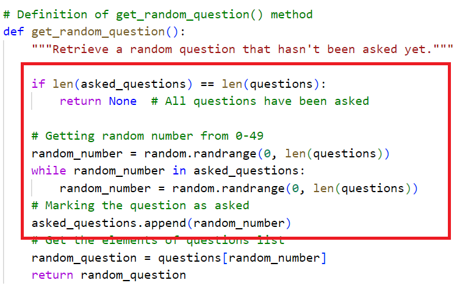

# Testing

> [!NOTE]  
> Return back to the [README.md](README.md) file.

## Code Validation

### Python

I have used the recommended [PEP8 CI Python Linter](https://pep8ci.herokuapp.com) to validate all of my Python files.

| Directory | File | CI URL | Screenshot | Notes |
| --- | --- | --- | --- | --- |
|  | questions.py | [PEP8 CI](https://pep8ci.herokuapp.com/https://raw.githubusercontent.com/wafia7510/fun-flicks/main/questions.py) |  | |
|  | run.py | [PEP8 CI](https://pep8ci.herokuapp.com/https://raw.githubusercontent.com/wafia7510/fun-flicks/main/run.py) |  | |

## Browser Compatibility

The Fun Flick game, deployed on Heroku, is a terminal-based application. It functions well across most modern browsers; however, there are some compatibility issues:

Tested Browsers: The game was tested on Google Chrome and Microsoft Edge, where it runs smoothly with no interruptions in performance.

Firefox Limitation: Unfortunately, Heroku's web console is currently not fully supported on Mozilla Firefox, and users may experience issues when trying to play the game in this browser. We recommend using Chrome or Edge for the best experience.

## Responsiveness

As Fun Flick is a terminal-based game, it doesn't have a traditional responsive design like a website. However, the game was tested to ensure it works smoothly on different screen sizes and resolutions across various devices:

- Desktop/Laptop: The game runs seamlessly in terminal environments on both large and small screens.
- Mobile Devices: While the game is playable on mobile devices, some formatting may not display perfectly due to terminal constraints on smaller screens. For the best experience, it's recommended to play the game on a desktop or laptop.

## Defensive Programming

In the Fun Flick quiz game, defensive programming techniques were implemented to ensure that the game runs smoothly, securely, and handles invalid inputs effectively.

1. Input Validation:

    - Expected: Users are prompted to enter valid options (A, B, C, or D) for answers. Only these inputs are acceptable.
    - Testing: Tested by entering a mix of valid and invalid inputs (e.g., numbers, special characters, or empty inputs).
    - Result: The game correctly prompts for valid input when invalid options are entered.
    - Fix: Any invalid inputs are handled gracefully, and users are shown an error message to re-enter a valid choice (A, B, C, or D).

2. Handling Edge Cases:

    - Expected: If all questions have been asked, the game should end properly and notify the user.
    - Testing: Repeated the game until all questions were answered.
    - Result: The game ends properly with no crashes and shows the final score.
    - Fix: Ensured that no question is repeated, and when the quiz is over, the game displays the "Game Over" message.

3. Preventing Crashes from Empty or Corrupt Question Data:

    - Expected: If there are no questions in the database (empty list), the game should notify the player and not crash.
    - Testing: Simulated an empty list of questions.
    - Result: The game safely informs the player that no questions are available and exits.
    - Fix: Added a check to handle empty or invalid question data without causing errors.

4. Replay Handling:

    - Expected: Players should be able to restart the game or exit gracefully after completion.
    - Testing: Tested the replay function by choosing both 'Y' and 'N' after game completion.
    - Result: The game restarts or exits properly based on the user's input.
    - Fix: Added input validation for the replay prompt, ensuring only 'Y' or 'N' is accepted.

Defensive programming was manually tested with the below user acceptance testing:

| Page | Expectation | Test | Result | Fix | Screenshot |
| --- | --- | --- | --- | --- | --- |
| | | | | | |
| Answer Input| User should enter A, B, C, or D | Tested with numbers, special characters, letters | Prompts for valid input if invalid characters| Added input validation for user answers |  |
|  | | | | | |
| Game Completion | Game should end after all questions are answered | Played until the last question | Displays "Game Over" message, no crashes| Handled edge cases for game completion|  |
| Difficulty Level Input | Players should be able to select a difficulty level by entering 1 (Easy), 2 (Medium), or 3 (Hard).| The difficulty level selection was tested with valid inputs (1, 2, 3) as well as invalid inputs like letters, numbers outside the expected range, special characters, and empty inputs.|  If the player enters an invalid input (e.g., letters, other numbers, or symbols), the game displays an error message and prompts the player to enter a valid option again without crashing or proceeding with an incorrect input.|  Input validation was added to ensure only 1, 2, or 3 is accepted. Invalid inputs trigger a message like "Invalid input, please enter 1, 2, or 3."|  |
| Empty Question Set | Game should exit gracefully if no questions exist | Simulated with an empty question list |Shows "No questions available" and exits | Added checks for empty or corrupt question data |  |
|  | | | | | |
| Replay Option | User should restart or exit based on input | Chose 'Y' to replay and 'N' to exit |Game restarts or exits based on input | Ensured valid input (Y or N) for replay|  |

## Bugs

1. **Issue with Input Validation:**

    - Bug: When users entered an invalid input (e.g., numbers or special characters) instead of A, B, C, or D, the game crashed.
    - Solution: Implemented input validation to ensure that only valid options (A, B, C, or D) are accepted. Invalid inputs prompt an error message, and the user is asked to try again.
    

2. **Question Repetition Bug:**

    - Bug: During the game, a question was occasionally repeated even though it was supposed to be asked only once.
    - Solution: Fixed by keeping track of already asked questions using a list and ensuring each question is asked only once during the game session.
    

3. **Game Not Ending Properly:**

    - Bug: In some cases, the game would not end after all questions were answered, causing it to loop indefinitely.
    - Solution: Corrected the logic to check if all questions had been answered and display the "Game Over" message appropriately.
    

4. **Display Formatting on Different Platforms:**

    - The terminal output appeared misaligned on some systems due to differences in screen resolution and terminal window sizes.
    - Solution: Adjusted formatting and used consistent spacing to ensure the game displays correctly across different systems (although primarily tested on Windows).
    
5. **No Bugs Identified for Other Platforms:**
    - Since testing was only conducted on Windows, no bugs were identified for macOS or Linux systems, though these platforms have not been tested yet.

## Unfixed Bugs
1. **Limited Cross-Platform Testing:**

    - Bug: The game has only been tested on Windows, and functionality on macOS or Linux is not guaranteed.
    - Reason Unfixed: No access to macOS or Linux machines for comprehensive testing.
    - Workaround: None currently, but the game is expected to work with minor adjustments. Users can report any issues they encounter on non-Windows systems.

2. **Game Freezing with Prolonged Idle Time:**

    - Bug: If the game is left idle for too long without user input, it occasionally becomes unresponsive.
    - Reason Unfixed: Unable to replicate the issue consistently for debugging.
    Workaround: Users should restart the game if it becomes unresponsive.

3. **Clear Method Limitation:** 
    - The clear() function, which is used to clear the terminal screen after each question, works as intended in local environment Windows. However, when deployed on Heroku, it only clears the visible portion of the terminal output, rather than the entire terminal. This results in previous content still being visible as the user progresses through the game. Unfortunately, this is a limitation of Heroku’s terminal environment, and no permanent fix has been found to completely resolve this issue on the platform.

4. **Keyboard Interrupt (Ctrl+C) Stops Execution:** 
    - Pressing certain key combinations, like Ctrl+C, during the game stops the normal execution and terminates the program unexpectedly. This is due to the keyboard interrupt signal that forces the application to quit. Currently, there is no handling implemented to catch this exception or prevent the termination, and it remains an unresolved issue.

5. **Input Behavior on Different Platforms:**
    - Apple Users (macOS): Users can smoothly enter their input and play the game without issues.Android Users (via terminal emulators): There may be some input inconsistencies, especially with terminal emulators on mobile devices, which could result in issues during gameplay. This may affect the input prompt behavior, but the core functionality remains intact.

> [!NOTE]  
> There are no remaining bugs that I am aware of.